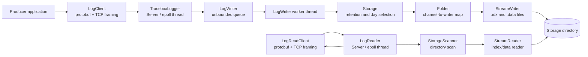
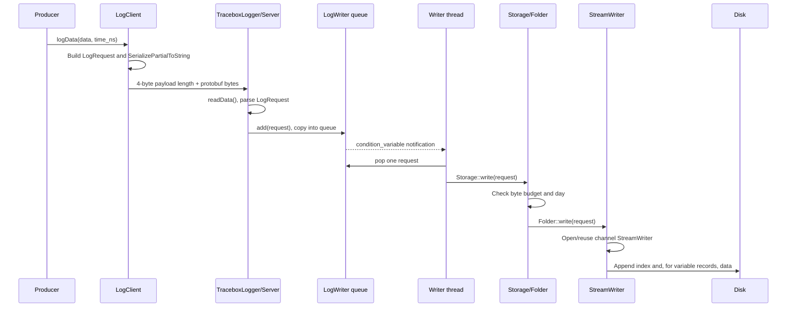

# Tracebox architecture

## Scope and review method

This document describes the implementation in this repository as it exists in
the current `tracebox` namespace. It is an architecture review, not a target
architecture. The observations below are based on the C++ sources, protobuf
schema, CMake targets, sample applications, and tests.

The two runtime services are intentionally separate:

* `TraceboxLogger` accepts `LogRequest` messages and hands them to an asynchronous
  writer.
* `LogReader` accepts `DataStreamsRequest` messages and reads the storage tree
  synchronously while servicing a client connection.

The libraries can also be used independently of the sample applications.

## Architecture overview



### Component summary

| Component | Responsibility | Main public API | Ownership and lifetime | Thread affinity |
| --- | --- | --- | --- | --- |
| `data_protos` | Generates protobuf message types | `LogRequest`, `DataStreamsRequest`, `DataStreamsResponse`, `DataPiece`, `DataStream` | Generated types are value-like protobuf objects owned by callers/containers | None |
| `TcpSocket` | Length-prefix framing and socket timeouts | `sendData()`, `readData()`, `setTimeout()` | Stateless utility; allocates a temporary send buffer or receive string | Caller’s thread |
| `Server` | Accepts TCP clients, waits with `epoll`, invokes a callback | `Server(port, callback)`, `start()`, `stop()` | Owns descriptors and one joinable service thread | Explicit state machine; stop wakes eventfd and joins |
| `TcpClient` | Connects to a server and exposes framed send/receive | `connect()`, `disconnect()`, `sendData()`, `readData()` | Owns one client socket; non-copyable; `-1` means disconnected | Caller’s thread |
| `LogClient` | Builds and sends logging protobufs | `logData()` | Inherits socket ownership from `TcpClient` | Caller’s thread |
| `LogReadClient` | Builds read requests and parses responses | `getStreams()`, `getData()` | Inherits socket ownership from `TcpClient` | Caller’s thread |
| `TraceboxLogger` | Write-service façade and request parser | Constructor starts service; private `handleLogRequest()` | Owns a `Server` and a `LogWriter`; non-copyable | Callback runs on `Server` thread; enqueue is synchronized |
| `LogWriter` | Decouples network ingestion from storage writes | `add()` | Owns a queue, `Storage` reference, and one worker thread | `add()` may be called by server thread(s); storage runs on worker |
| `Storage` | Enforces byte budget and selects the active day | `write()` | Owns the active `Folder` | Worker thread only in normal composition |
| `StorageBackend` / `FilesystemStorageBackend` | Internal boundary between storage policy and filesystem persistence | `usedBytes()`, `removeOldest()`, `write()` | `Storage` owns the backend; filesystem backend owns `Folder` | Worker thread only |
| `Folder` | Represents one day and maps channel names to writers | `write()`, `sameDay()`, `close()` | Owns `StreamWriter` objects in a map | Worker thread only |
| `StreamWriter` | Appends one channel’s index/data files | `openFile()`, `write()` | Owns injectable `FileIO` handles | Worker thread only |
| `FileIO` / `StandardFileIO` | File-system boundary used by `StreamWriter` | `open()`, `write()`, `flush()`, `close()` | `StreamWriter` owns handles through `unique_ptr`; tests may supply a derived mock | Caller’s thread |
| `StorageScanner` | Finds streams and retrieves records | `getStreams()`, `getData()` | Value-like scanner holding a storage path | Calling thread; normally a server thread |
| `StreamReader` | Combines an index reader with an optional data reader | `matchTime()`, `read()`, status/accessors | Owns readers for one `.idx` stream | Calling thread |
| `FileReader`, `IndexFileReader`, `DataFileReader` | Parse headers and records from disk | Reader-specific methods | Own their `ifstream` and parsed header | Calling thread |
| `StreamsCombiner` | Groups client results by second and stream index | `addRecords()`, `save()` | Owns maps/vectors of protobuf-derived records | Caller’s thread |
| `AscWriter` | Converts combined records to CANoe ASC text | `write()` | References caller-owned output stream and stream map | Caller’s thread |

The sample applications compose these components but do not add a lifecycle
manager: `logger` and `logger_demo` run an infinite sleep loop after creating
the services; the client samples also use retry/input loops.

## Data recording pipeline



There is no application-level response for a logging request. The callback
returns an empty string, so the server does not send an acknowledgement. A
successful client `sendData()` therefore means only that the framed bytes were
accepted by the TCP stack, not that the record reached storage.

The queue copy is a deliberate decoupling point, but it also means that the
producer can outrun the storage worker without backpressure. `Storage::write()`
returns an error or zero for storage failures, but `LogWriter` currently ignores
that return value.

## Storage architecture

### Directory and file layout

The configured root contains one directory per local calendar day:

```text
<storage-root>/
  20240101/
    120314_sensor_0.idx
    120314_sensor_0.data       # only for variable-size records
    120314_can_8.idx
```

The base name is generated as `HHMMSS_<channel>_<record_size>`. If a file with
the same base name already exists, `_1`, `_2`, and so on are appended. The day
and file timestamp use the process-local timezone through `localtime()`.

`Folder` starts with no day. The first write creates the day directory and the
first writer per channel. `Storage` creates a new `Folder` when the request’s
day differs from the active folder. Existing `StreamWriter` instances are
closed when their `Folder` is destroyed.

### File header

Both file types begin with the packed `LogFileHeader` from `libs/data_types.h`:

| Field | Type | Meaning |
| --- | --- | --- |
| `header_size_` | `uint16_t` | Offset to the first record |
| `timestamp_ns_` | `uint64_t` | File creation timestamp as supplied to the writer |
| `record_size_` | `uint32_t` | Fixed payload size, or `0` for variable records |
| `major_version_`, `minor_version_` | `uint8_t` each | Currently `1.0` constants |
| `file_type_` | `uint8_t` | `1` index, `2` data |
| `name_` | 32 bytes | Channel name, truncated if necessary |

The struct is packed and has no explicit byte order conversion. The format is
therefore host-endian and compiler/ABI-sensitive despite the explicit version
fields.

### Index and data records

For fixed-size channels, only the `.idx` file is used:

```text
index header
  repeated: uint64_t time_ns + <record_size> payload bytes
```

For variable-size channels, the `.idx` file contains:

```text
index header
  repeated: uint64_t time_ns + uint32_t data_offset
```

The paired `.data` file contains:

```text
data header
  repeated: uint64_t time_ns + uint32_t payload_size + payload bytes
```

The index offset points to the beginning of the variable data record’s data
header. The timestamp is duplicated in both files.

### Timestamp handling

Timestamps are caller-provided nanoseconds since the Unix epoch. They are used
for record ordering as written, for day-directory selection after conversion
through `localtime()`, and for query filtering. The implementation does not
validate monotonicity, clock source, timezone consistency across machines, or
future/invalid values.

Storage policy is separated from the current persistence medium through the
internal `StorageBackend` interface. `Storage` owns the byte budget and asks
the backend for used bytes, oldest-day deletion, and writes.
`FilesystemStorageBackend` is the only implementation; it owns the root path,
filesystem scans, day deletion, and the active `Folder`. The reader path remains
directly coupled to the index/data files because its query and corruption
semantics have not been generalized.

### Retention and rollover

`Storage` is initialized with a byte budget. It scans immediate day
subdirectories and sums regular files. Before a write, it estimates the worst
case size using `maxRecordSize()`. If the estimate exceeds available space, it
repeatedly deletes the numerically oldest day directory. If no removable day
exists, the write returns `0`.

Retention is directory-granular rather than record-granular. The active folder
is replaced when the calendar day changes. There is no explicit size-based
rollover within a day; multiple files arise from repeated opens or same-second
name collisions.

### Fragmentation and recovery

Variable records are written to `.data` before their corresponding `.idx`
entry. The test fault injector can throw after the data write and before the
index commit. On restart, the orphaned data bytes are not indexed and are
ignored by the reader. This gives a useful append-order property, but it does
not reclaim orphaned data or provide a journal.

The reader derives record counts from file size and fixed record width. It does
not verify that a file ends on an exact record boundary, that offsets point to
valid data records, that duplicated timestamps agree, or that the filename
matches the header. Header presence and file type are checked in selected
paths; corruption generally becomes an empty stream or a read error rather
than a structured recovery result.

### Strengths and weaknesses

Strengths:

* Append-only writes are simple and require no database engine.
* Fixed-size channels avoid a separate data file.
* Day directories make coarse retention and manual inspection straightforward.
* Variable data is written before its index entry, limiting visibility of
  partially written records.
* File I/O is now an explicit extension point, enabling deterministic failure
  tests and platform-specific implementations.

Weaknesses and embedded assumptions:

* The format is host-endian and uses packed C++ structs directly.
* `uint32_t` file sizes and offsets limit individual files and make overflow
  handling dependent on a size estimate.
* Retention scans and deletes whole day directories; a single large request can
  trigger expensive deletion work on the write thread.
* There is no fsync or equivalent durability barrier. `flush()` only flushes the
  C++ stream buffer.
* Power loss after a data write can leave unreferenced bytes; power loss during
  an index write can leave a malformed trailing record.
* The root directory must already exist for `Storage` and `StorageScanner`
  construction paths that iterate it.
* Local timezone conversion means a deployment’s timezone changes the on-disk
  day partitioning.

## Reader architecture

`StorageScanner::getStreams(start, end)` performs the following work:

1. Convert the query endpoints to local `YYYYMMDD` values.
2. Iterate every immediate child of the storage root.
3. Parse numeric day directory names and retain those in the day range.
4. Iterate each selected directory and inspect `.idx` files.
5. Construct a temporary `StreamReader` for each index.
6. Include a stream if its first/last indexed timestamp overlaps the query.

`IndexFileReader` calculates `records_cnt` from file size and record width, then
reads record `0` and the last record to cache `start_ns` and `end_ns`.
`matchTime()` is an O(1) overlap check after those reads. It is not a binary
search and does not inspect every timestamp during stream discovery.

`StorageScanner::getData()` constructs one `StreamReader`, rejects queries that
do not overlap or whose `start_idx` is outside the stream, then walks records
from `start_idx` until either the end or `max_size`. Each returned record is
additionally filtered against the exact timestamp range. The complexity is
O(number of scanned records), with one seek/read sequence per record. There is
no index acceleration for an arbitrary start timestamp.

The response is accumulated in protobuf containers before serialization. A
large query therefore consumes memory proportional to the returned data, in
addition to per-record temporary buffers.

## Writer architecture

### Synchronization and buffering

`TraceboxLogger::Server` invokes its callback on the server’s epoll thread. The
callback parses the protobuf and calls `LogWriter::add()`. `add()` takes a
mutex, copies the request into an unbounded `std::queue`, releases the mutex,
and notifies the worker condition variable.

The worker owns the normal storage mutation path. `Storage`, `Folder`, and
`StreamWriter` are not internally synchronized and are safe only when their
callers serialize access. The queue is the only synchronization boundary in
the write path.

There is no batching at the protobuf or storage layer: the worker pops one
request and performs its file operations. File buffers are flushed at open and
when approximately one second has elapsed since the last recorded flush. The
flush decision is based on wall-clock duration, not a record count or byte
threshold.

### Durability, latency, and throughput

The network acknowledgement is absent, so the producer sees low application
latency but has no durability confirmation. The worker’s queue reduces network
thread latency at the cost of unbounded backlog and delayed failure reporting.

Writes use multiple stream operations per record. Variable records require
three data writes, optional data flush, two index writes, and optional index
flush. The dominant bottlenecks are likely filesystem latency, directory scans
during retention, and serial processing by the single worker. There is no
group commit, `fsync`, preallocation, compression, or asynchronous I/O.

## Networking and protocol

### Transport framing

`TcpSocket` frames each application message as:

```text
uint32_t payload_size   # native host byte order
payload_size bytes      # protobuf serialization
```

The sender constructs one contiguous buffer and calls `send()` once. A short
send is treated as failure. The receiver reads the four-byte length and then
loops until the payload is complete. A zero-length decoded string is used as an
error signal, which makes an actual empty application payload indistinguishable
from failure at this layer.

Sockets use POSIX APIs, `SO_SNDTIMEO`/`SO_RCVTIMEO`, `MSG_NOSIGNAL`, and numeric
IPv4 parsing through `inet_aton()`. There is no TLS, authentication, access
control, compression, negotiated version, maximum declared payload size, or
cross-endian framing.

`TcpClient` owns exactly one descriptor. `connect()` first disconnects any
existing descriptor, validates a port in 1..65535, and keeps a local RAII
descriptor until address parsing, timeout setup, and synchronous connection
succeed. Only then is the descriptor transferred to the client. Failed attempts
therefore leave the client disconnected and close every created descriptor;
`connect()` retries only `EINTR`. `disconnect()` is idempotent and treats fd 0
as valid. Client `SO_SNDTIMEO` and `SO_RCVTIMEO` setup failures are fatal to the
connection attempt; no automatic reconnection or retry policy is added.

### Services and protobuf interaction

The write service receives `LogRequest` and deliberately returns no response.
The read service receives `DataStreamsRequest`:

* Without `file`, it returns `DataStreamsResponse.stream` entries for matching
  index files.
* With `file`, it returns `DataStreamsResponse.data` entries for that index.

The protobuf comments require fields to remain optional, field numbers never to
change, and incompatible type changes to use a new field number. Generated
protobuf C++ and Python files are build outputs; the repository stores the
`.proto` source.

Compatibility is constrained by more than protobuf: the native-endian length
prefix, native packed storage records, local-time day naming, and
storage-root-relative index identifiers in `DataStream.file` all assume
compatible peers or a shared deployment environment. The reader resolves those
identifiers through canonical filesystem paths and accepts only regular,
valid `.idx` files beneath its configured storage root; absolute paths,
traversal, symlink escapes, directories, unrelated files, and `.data` files
are rejected as `invalid reader path`. The TCP service remains unauthenticated
and requires a trusted deployment network. The wire schema uses `proto3` optional fields, but the current
server selects a zero maximum count when a read request omits `max_count`; the
provided client normally supplies `UINT32_MAX` explicitly.

## Threading and shutdown model

### Threads

| Thread | Created by | Work | Shutdown |
| --- | --- | --- | --- |
| Write worker | `LogWriter` constructor | Waits on queue and calls `Storage::write()` | Shutdown stops admission, drains the queue, and joins |
| TCP service thread | `Server::start()` | Owned thread runs `epoll_wait`, accepts clients, reads frames, invokes callback | `stop()` changes state, writes eventfd, closes clients, and joins |
| Caller threads | Applications | Client calls, input loops, or sample main loops | Application-controlled |

`Server` has explicit `kStopped`, `kStarting`, `kRunning`, and `kStopping`
states. Construction does not start the endpoint; `TraceboxLogger` and
`LogReader` start their server only after their callback target and dependent
state have been constructed. `start()` is false unless the state is stopped,
and a completed `stop()` permits a subsequent restart.

The `Server` object owns the listening, epoll, eventfd, and accepted-client
descriptors. Startup creates and registers epoll/eventfd/listener resources;
every partial failure closes all resources. The service thread exclusively
maintains the accepted-client collection during operation. `stop()` enters
stopping, writes the eventfd, and joins; the worker then removes and closes
every active client and the listener before the owner closes eventfd and epoll.
No polling timeout or detached work remains. A callback already in progress is
allowed to finish; no callback starts after the stopping state is observed,
and callback exceptions close only the affected client.

`LogWriter` protects both `stopping_` and `queue_` with `mutex_`. `add()`
returns true only when it admits a request. Once `stop()` sets `stopping_`,
new entries are rejected, the condition variable wakes the worker, every
accepted entry is written, and the worker is joined. Repeated `stop()` calls
are safe. The public `Writer::add()` remains void, so its existing API cannot
report admission rejection; the internal logger callback ignores that result
as before.

## Memory usage

Bounded allocations:

* `StreamWriter` owns a constant number of file handles and metadata per active
  channel in the current `Folder`.
* Reader metadata for one stream is small and includes one header object and
  stream state.
* The TCP receive payload is allocated to the declared `uint32_t` length.

Potentially unbounded allocations:

* `LogWriter::queue_` grows with producer/storage imbalance.
* `DataStreamsResponse` grows with the number of streams or requested records.
* `DataFileReader` allocates a payload-sized temporary buffer for every
  variable record read.
* `StreamsCombiner::seconds_` retains all records in the selected interval until
  `save()`.
* `TcpSocket::sendData()` allocates a complete framed copy of each message.

Long-lived allocations include one worker queue, one storage object, active
channel writers, and one server object/thread per service. The code has no
explicit maximum protobuf message, queue depth, response size, or per-record
payload beyond the 32-bit format fields.

## Embedded suitability

The design has useful embedded properties: a small dependency surface in the
core libraries, sequential append writes, simple recovery semantics, no
database daemon, and an injectable file boundary. The fixed-size path avoids
the second data file and can be efficient for regular telemetry.

The current implementation is not deterministic enough for a constrained
embedded target without additional policy. Directory scans and recursive day
deletions are unbounded with respect to the number of files. Queue and response
memory are not capped. POSIX epoll, sockets, `localtime()`, `std::filesystem`,
protobuf, C++ threads, and dynamic allocation are assumed. Flash durability is
not guaranteed because there is no explicit sync barrier; repeated headers,
index/data writes, and orphaned variable data may increase write amplification.
Startup scans all day directories and may delete multiple days before serving
requests.

Portability is also limited by direct POSIX headers, Linux `epoll`, packed
native structs, native-endian framing, and the use of `localtime()` rather than
a platform abstraction.

## Dependencies

| Dependency | Used by | Why it exists | Core or optional |
| --- | --- | --- | --- |
| C++17 standard library | All components | Filesystem, threads, containers, strings, streams, smart pointers | Core implementation assumption |
| POSIX/Linux sockets and `epoll` | `TcpSocket`, `TcpClient`, `Server` | TCP transport and event loop | Core for network runtime; not needed for storage-only builds |
| Protobuf compiler/runtime | `data_protos`, clients, services, readers/writers | Serialized request/response and record API types | Core to the current public protocol |
| gflags | `apps/logger.cpp`, `apps/get_can.cpp` | Command-line configuration | Optional; application-only |
| GoogleTest | `tests` | Unit tests | Development/test-only |
| Abseil | Optional test linkage when protobuf exposes `absl::log` and `absl::check` targets | Protobuf build/runtime compatibility in the test target | Optional |
| Commons | Optional CMake integration when a sibling `../commons` tree exists or BitBake defines integration state | Legacy/build-environment compatibility; logger libraries do not link to it | Optional and outside the core |
| CMake | Build configuration | Target composition and protobuf generation | Build-time |
| Ninja | Docker/recommended build generator | Fast reproducible builds | Build-time/tooling |
| Docker/Compose | `Dockerfile`, `docker-compose.yml` | Reproducible Linux development environment | Development-only |

## Extension points

* `FileIO` and `StreamWriter::FileIOFactory` permit alternate storage backends,
  failure injection, and platform-specific file implementations.
* `StreamWriter::FaultInjector` exposes the currently modeled power-loss point
  between variable data write and index commit.
* `Server` accepts a callback for application message handling.
* `LogWriter` accepts a shared `Storage`, allowing storage lifetime to be
  managed outside the writer.
* Protobuf fields can be extended additively under the schema compatibility
  rules.
* `StreamsCombiner::save()` accepts a callback and `AscWriter` is one current
  output implementation.
* Storage and reader classes are separable from the network services and can be
  used in local tests or applications.

## Strengths

* Clear separation between network ingestion, asynchronous persistence, and
  read-side scanning.
* Simple, inspectable append-only file layout.
* Fixed-size and variable-size records share the same stream abstraction.
* Coarse retention is easy to reason about operationally.
* Client and service payloads use a versionable schema rather than ad hoc
  serialization.
* Tests cover normal writes, day retention, malformed files, reader behavior,
  and injected write failures.

## Risks and design-review findings

1. **No durability acknowledgement.** A successful log client send does not
   indicate queue acceptance, disk write success, or durable media state.
2. **Unbounded memory.** Queue depth, TCP payload size, reader response size,
   and combiner retention are not bounded.
3. **Wire-format portability.** Length prefixes and packed storage records use
   native byte order and ABI layout.
4. **Weak corruption model.** File size and header checks are partial; offsets,
   record boundaries, duplicated timestamps, and trailing partial records are
   not comprehensively validated. Malformed variable lengths/offsets and
   truncated payloads now fail closed, but no checksums or startup recovery
   exist.
5. **Query cost.** Every stream discovery query scans directories and opens
   candidate index files; data retrieval walks records linearly.
6. **Retention accounting.** The estimate is intentionally conservative and
   retention is day-granular; a write can cause a large synchronous delete.
7. **Time-zone coupling.** Day partitioning depends on process-local timezone
   state and non-thread-safe `localtime()` APIs.
8. **Protocol behavior edge cases.** The native framing has no maximum length
    or version field, and omitted read `max_count` is interpreted as zero by
    the server path.

## Open questions

* Is the storage format intended to be portable between architectures, or only
  between processes built for the same target?
* What durability level should a future producer acknowledgement represent:
  queued, written to the OS, flushed, or synchronized to media?
* Should retention be based on bytes, age, record count, or a combination?
* What is the intended maximum record size, queue depth, response size, and
  number of concurrent clients?
* Are timestamps guaranteed to be monotonic per stream, globally ordered, or
  merely observational client timestamps?
* Should a missing or mismatched variable `.data` file be exposed as a stream
  status, skipped, or repaired?
* Is the network protocol private/local, or does it require a compatibility and
  security contract for independent clients?
* Which platforms besides Linux/POSIX must the storage and network layers
  support?
* Should the generated Python protobuf output be treated as a supported client
  API or only a build artifact?
* Is `commons` still required in any production build, or can the optional
  compatibility branch be retired after downstream validation?
