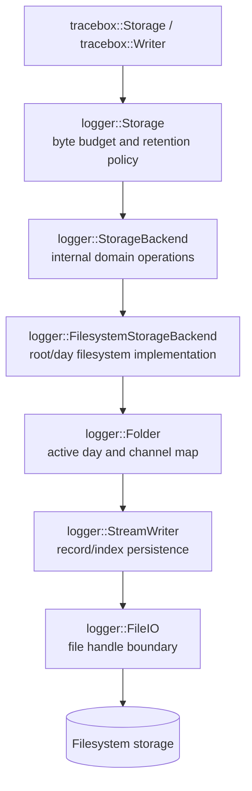

# Tracebox storage architecture

## Scope

PR-3 isolates the current filesystem-backed persistence implementation behind
an internal storage backend boundary. It does not add a backend, change record
semantics, or alter the on-disk or network format.

The public `tracebox::Storage` and `tracebox::Writer` façades remain unchanged.
They still delegate to the existing `tracebox::logger` implementation classes.

## Responsibilities before the boundary

Before PR-3, `tracebox::logger::Storage` directly owned and performed all of
these responsibilities:

| Responsibility | Previous owner | Behavior |
| --- | --- | --- |
| Storage root path | `Storage` | Stores the configured root directory |
| Used-byte scan | `Storage` | Iterates day directories and sums regular-file sizes |
| Oldest-day selection | `Storage` | Parses numeric directory names and chooses the smallest day |
| Day deletion | `Storage` | Sums files in the selected day and removes the directory tree |
| Active-day rollover | `Storage` | Replaces `Folder` when the request day changes |
| Channel-to-file mapping | `Folder` | Owns one `StreamWriter` per channel for a day |
| File path generation | `StreamWriter` | Creates `HHMMSS_channel_size` names and collision suffixes |
| File open/close/flush | `StreamWriter` and `FileIO` | Opens `.idx` and optional `.data` files |
| Record persistence | `StreamWriter` | Writes headers, data records, and index records |
| Index persistence | `StreamWriter` | Commits timestamps/offsets to `.idx` |
| File-system primitive | `std::filesystem`, `StandardFileIO` | Directory enumeration, deletion, and file streams |
| Byte-budget policy | `Storage` | Deletes oldest days until the conservative request estimate fits |

The old `Storage` class therefore combined policy with filesystem location
management and delegated record-level persistence to `Folder`/`StreamWriter`.

## Boundary after PR-3



The internal interface is:

```cpp
class StorageBackend {
public:
    virtual ~StorageBackend() = default;
    virtual std::size_t usedBytes() const = 0;
    virtual bool removeOldest(std::size_t& freed_bytes) = 0;
    virtual int write(const LogRequest& request) = 0;
};
```

`FilesystemStorageBackend` is the only implementation. It owns the storage
root path and the active `Folder`. `Storage` owns a `unique_ptr<StorageBackend>`
and retains the byte-budget algorithm. The interface is internal under
`libs/log_writer/storage_management/`; it is not included from
`include/tracebox/` and is not configurable through the public API.

## Responsibility mapping

### `Storage`

`Storage` is now storage policy/orchestration:

* initialize the available-byte counter;
* ask the backend for current used bytes;
* request oldest-day deletion until the estimated request fits;
* subtract accepted write bytes from the available budget;
* delegate day selection and persistence to the backend.

The retention semantics are intentionally unchanged, including the existing
conservative `maxRecordSize()` estimate and day-granular deletion behavior.

### `StorageBackend`

The interface contains only operations that `Storage` needs to enforce its
existing policy:

* `usedBytes()` reports the current backend footprint;
* `removeOldest()` removes the backend’s oldest day and reports bytes freed;
* `write()` persists the existing `LogRequest` semantics and performs the
  backend’s existing active-day rollover.

The interface does not contain record encoding, index lookup, timestamp
conversion, network operations, or a generic block-device API. Passing the
existing `LogRequest` is deliberate: record semantics remain in the current
writer path instead of being prematurely generalized.

### `FilesystemStorageBackend`

The filesystem implementation owns:

* the root directory string;
* used-byte enumeration;
* numeric oldest-day selection;
* day-tree deletion and freed-byte calculation;
* the active `Folder` and day rollover delegation.

It still uses `Folder`, `StreamWriter`, and `FileIO` for channel/file behavior.
This preserves the current file naming, headers, record ordering, flushing, and
power-loss behavior.

### `Folder`, `StreamWriter`, and `FileIO`

These remain intentionally coupled to the current filesystem record model:

* `Folder` maps a channel name to a `StreamWriter` and creates day directories.
* `StreamWriter` creates paired index/data files, writes the packed headers and
  records, handles name collisions, and applies the current flush policy.
* `FileIO` abstracts an individual file handle and already supports the
  production `StandardFileIO` and test fault injection.

The new backend boundary does not duplicate or reinterpret those responsibilities.

## Ownership and lifetime

```text
public tracebox::Storage
  owns unique_ptr<logger::Storage::Impl>
    owns shared_ptr<logger::Storage>
      owns unique_ptr<logger::StorageBackend>
        owns unique_ptr<Folder>
          owns map<string, StreamWriter>
            owns FileIO handles
```

The public `tracebox::Writer` retains the internal storage through its existing
shared ownership and starts the existing worker thread. The worker invokes
`logger::Storage::write()`, which calls the backend. The backend, folder, and
stream writers are expected to be used by that worker thread only in the normal
composition.

`StorageBackend` itself has no synchronization. The interface is an ownership
and dependency boundary, not a concurrency boundary. A backend instance must
be externally serialized just as the old `Storage` implementation was.

## Dependency direction

```text
include/tracebox public façades
            |
            v
src/tracebox_api.cpp
            |
            v
logger::Storage / logger::LogWriter
            |
            v
logger::StorageBackend
            |
            v
FilesystemStorageBackend
            |
            v
Folder -> StreamWriter -> FileIO -> std::filesystem/ofstream
```

`Storage` no longer includes `folder.h` or uses `std::filesystem` directly.
The concrete backend still does. This is the smallest boundary that removes
filesystem location/retention mechanics from storage policy without changing
record semantics.

The reader path is intentionally not routed through this backend in PR-3.
`StorageScanner`, `StreamReader`, and the file-reader classes open persisted
files directly because they implement the existing index/data read format and
query behavior. A future reader-side backend would need to define how indexed
files, offsets, corruption status, and query metadata are represented; adding
that abstraction now would be speculative.

## What remains intentionally coupled

The following are not abstracted:

* packed `LogFileHeader`, index records, and variable data records;
* local-time day conversion and day-directory names;
* byte-budget and oldest-day retention semantics;
* `Folder` channel mapping and `StreamWriter` file rollover;
* index/data write ordering and the current flush interval;
* protobuf `LogRequest` as the internal write contract;
* reader access to `.idx` and `.data` files;
* POSIX/network transport;
* `std::filesystem` path and directory behavior inside the filesystem backend.

These couplings are intentional because each is part of current observable
behavior or requires a separate compatibility decision.

## Requirements for a future alternative backend

No alternative backend is implemented by this PR. A future implementation
would need to satisfy the internal `StorageBackend` contract and preserve the
following observable behavior unless the public/storage compatibility contract
is deliberately revised:

1. Report a footprint compatible with the byte-budget policy.
2. Identify and remove the oldest retention unit in the same ordering model,
   or document a compatible replacement policy.
3. Preserve day rollover decisions for supplied timestamps.
4. Accept existing `LogRequest` semantics, including fixed versus variable
   record sizes.
5. Return the same positive/zero/negative write result categories.
6. Preserve per-channel ordering as observed by readers.
7. Provide a recovery story for interrupted writes before durable deployment.
8. Define lifetime, thread affinity, capacity, and failure behavior.

For raw flash, SPI/QSPI flash, SD cards, or RTOS block devices, the current
interface is only a policy seam. Those media would still need a separate file
layout/access strategy because the current `Folder`/`StreamWriter` path assumes
filesystem paths and seekable file handles. The interface should not be
expanded with speculative erase-block, wear-leveling, or asynchronous-I/O
methods until a concrete device contract exists.

## Known limitations

* The root directory must satisfy the existing constructor assumptions;
  backend construction does not create a missing root.
* Used-byte scans and oldest-day selection remain synchronous and directory
  based.
* Day deletion remains whole-directory and can be expensive.
* The backend does not add journaling, checksums, fsync, orphan cleanup, or
  corruption repair.
* The reader still has direct filesystem coupling and linear query behavior.
* The internal interface is not a stable ABI and may change with the storage
  implementation.
